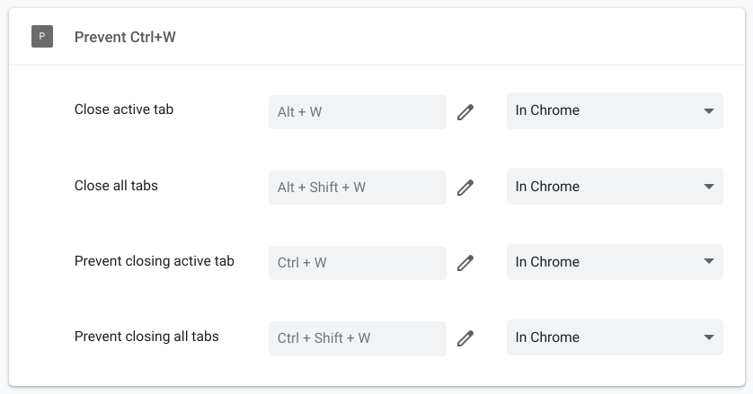

# Prevent Ctrl+W Chrome Extension

A chrome extension to overwrite the `Ctrl + W` shortcut from closing the active tab. Also, it will trigger a keyboard event which allows you to use the `Ctrl + W` key combination in your websites.

## Install and setup

1. Navigate to `chrome://extensions`

2. Click `Load unpacked`

3. Select folder for this repository

4. Navigate to `chrome://extensions/shortcuts`

5. Overwrite shortcuts (see image below)

